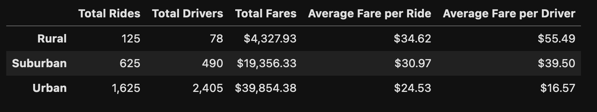
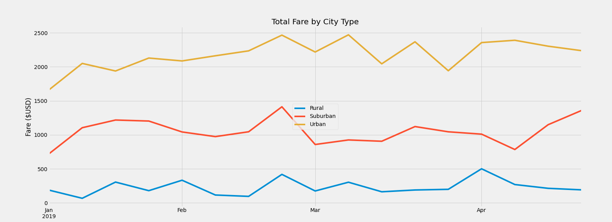

# PyBer_Analysis

## Overview 
Our aim was to summarize, then analyze PyBer's ride-sharing data by types of cities: Urban, Suburban, and Rural. Additionally, we aimed to glean insights by reviewing total weekly fares for each type of city. 

## Results
Using images from the summary DataFrame and multiple-line chart, describe the differences in ride-sharing data among the different city types.

Reviewing our summary, we see one thing that sticks out: there is an obvious difference between the rural data and other city types. In particular, there is a wide gulf between rural and urban city types. 

While the number of total rides, total drivers, and total fares for rural cities is quite low, the following is worth calling out:
* the average fare per ride for rural cities is $10 and nearly $4 higher than urban and suburban cities, respectively
* the average fare per driver is nearly $39 and $23 higher than urban and suburban city types, respectively. 
* consider reviewing the ratio of drivers to rides as well  
    * Rural: 0.6 drivers to rides
    * Suburban: 0.7 drivers to rides
    * Urban: 1.5 drivers to rides

The chart below shows total fare by each type of city by week (Jan 01, 2019 through Apr 28, 2019). 

Two observations to note from this data: 
1. Urban cities' fares vary widely from the end of March through April. A year-over-year investigation may be necessary to determine whether this trend occurs each year around the same time. Additionally, we should analyze whether efforts can be made to make this oscillation more stable; stakeholders and drivers would appreciate predictability. 
2. Suburban fares appear to increase quite steadily in early-April onward. A closer review of data beyond early Q2-2019 is in order. We'll want to determine whether this increase in fare amounts for suburban cities continues into the spring and summer. 

## Summary

After conducting our analysis of PyBer data by city types, we have the following recommendations: 
1. Decrease fare amounts in rural cities. While volume is much higher in other types of cities, especially urban cities, PyBer will likely both attract new riders as a result. 
2. Increase share, provide healthcare benefits, and provide stipends to defray costs of vehicle maintenance to drivers in all city types. 
    * In particular, the ratio of drivers to rides in urban cities hints at two things: 1) there is an abundance of drivers, 2) there are a high number of short-term drivers. Reducing this ratio by providing less tenuous employment will ensure long-term drivers, leading to a more predictable experience for riders. 
    * Additionally, providing these types of benefits will likely increase the number of drivers available in rural cities. More analysis might be necessary, but the lack of drivers available in rural cities tells us that riders may not be invested in PyBer. A lack of reliable and available rides means less riders on the whole. 
3. To offset costs associated with the above two points, urban fares could be increased slightly, particularly for shorter trips. For example, longer trips to the airport or a public transit station should still remain economical options. 